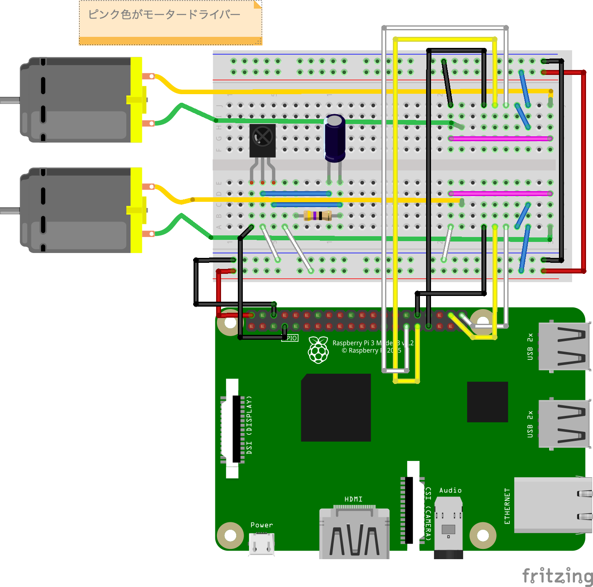

# IRラジコン作成
今回は 赤外線でモーターを操作できるようにします。

## 前提
[WEBラジコン作成](../web_radio_controller/WEBラジコン作成.md)
のモーター制御サーバー作成 を終えている必要があります。

事前に[赤外線リモコン学習](../ir_remote_controller.md)を確認し、
赤外線リモコン学習を理解しておく必要があります。

## 必要なパーツ
| メーカー | 秋月 通販コード | 型番 | 商品名 | 個数 |
|--|--|--|--|--:|
| Anker | - | A1263011-9 | Anker PowerCore 10000 (モバイルバッテリー 10000mAh) | 1 |
| 協和ハーモネット | P-02220 | TCW 0.6mm 10m | スズメッキ線（０．６ｍｍ　１０ｍ） | 1 |
| 東芝 | I-02001 | TA7291P | モータードライバ | 2 |
| TAMIYA | - | ITEM 70168 | ダブルギヤボックス | 2 |
| TAMIYA | - | ITEM 70098 | ユニバーサルプレート | 1 |
| TAMIYA | - | ITEM 70229 | 32mm径スプロケット＆クローラーセット | 1 |
| logicool | - | C270N HD WEBCAM | ロジクールWebカメラ| 1 |
| I-06487 | GP1UXC41QS | 赤外線リモコン受信モジュール | 1 |  |
| P-03120 | 35PK47MEFC5X11 | 電解コンデンサ 47μF | 1 | 赤外線受信モジュール用 |
| R-07964 | CFS100J47RB | カーボン抵抗 47Ω | 1 | 赤外線受信モジュール用<br>1Wが良いですが、<br>一時的にであれば1/2Wや1/4Wで代用 |

## 配線



## 動作確認用のコード

### `bundle init`

```bash
cd ~/
mkdir IRMortorControl; cd $_
bundle init
```

### Gemfile 編集

```ruby
# frozen_string_literal: true

source "https://rubygems.org"

git_source(:github) {|repo_name| "https://github.com/#{repo_name}" }

gem 'pi_piper'
```

### bundelインストール
```bash
bundle install --path vendor/bundle
```

#### 赤外線学習した内容と一致しているかを確認するメソッドを作成します。
`ir_mortor_control.rb` を作成し以下メソッドを追加します。

時間差を記録する仕組みのため、毎回同じ学習値の内容となりません。
差分の許容量と一致率を定義し、一致率が80%以上のものを同一とします。

```ruby
# 受信時比較の許容一致率
EQUALS_PERSENT = 80
# 時間差比較時に許容する時間差
EQUALS_DIFF = 400
# 末尾比較対象外要素数
END_CUT_COUNT = 20

def equlsTimings(array1, array2)
  if array1.nil? || array2.nil?
    return false
  end

  if array1.size == 0 || array2.size == 0
    return false
  end

  max = array1.size - END_CUT_COUNT

  result = []
  array1.each_with_index do |value,index|
    break if index == max
    break if index >= array2.size
    diff = value - array2[index]
    diff = diff.abs
  
    if(diff < EQUALS_DIFF)
      result.push(true)
    else
      result.push(false)
    end
  end

  persent = result.count(true) * 100 / result.size.to_f
  
  puts persent
  return persent > EQUALS_PERSENT
end

```

#### モーター制御タスクに命令を実行するメソッドを追加
```ruby
def send_request(function_name)
  puts("send request mortor:" + function_name)
  socket = TCPSocket.open('localhost', 2000)

  socket.puts function_name
  socket.flush
  response = socket.gets
  response if response.present?
rescue
  nil
ensure
  socket.close if socket
end
```


#### 赤外線の内容をモーター制御命令に変換するメソッドを作成します。
```ruby
# 例 リモコンの学習した時間差をそれぞれの定数値に修正して使用する
# 前進   
FORWARD_TIMINGS = []
# 左     
LEFT_TIMINGS = []
# 右     
RIGHT_TIMINGS = []
# バック  
BACK_TIMINGS = []
# ブレーキ 
BREAKE_TIMINGS = []
def convert_ir_to_mortor_order(captureTimings)
  mortor_order = ""
  if equlsTimings(FORWARD_TIMINGS, captureTimings)
    mortor_order = "Forward"
  elsif equlsTimings(LEFT_TIMINGS, captureTimings)
    mortor_order = "Left"
  elsif equlsTimings(RIGHT_TIMINGS, captureTimings)
    mortor_order = "Right"
  elsif equlsTimings(BACK_TIMINGS, captureTimings)
    mortor_order = "Back"
  elsif equlsTimings(BREAKE_TIMINGS, captureTimings)
    mortor_order = "Breake"
  end

  return mortor_order
end
```

#### 赤外線読み取りと赤外線監視メソッドを追加します。

```ruby
def watch_ir()
end

def read_ir(ir_receiver, signal)
  return captureTimings
end
```

#### 上記までのコードは以下のようになります。

```ruby
#
# 赤外線リモコンによるモーター操作
#
require 'pi_piper'
include PiPiper
# =====IR 設定======
# 受信時の記録タイムアウト時間(秒)
RECORDING_TIMEOUT = 1
# 受信時比較の許容一致率
EQUALS_PERSENT = 80
# 時間差比較時に許容する時間差
EQUALS_DIFF = 400
# 末尾比較対象外要素数
END_CUT_COUNT = 20

# ===リモコンとモーター制御の設定===
# 例 リモコンの学習した時間差をそれぞれの定数値に修正して使用する
# 前進   
FORWARD_TIMINGS = []
# 左     
LEFT_TIMINGS = []
# 右     
RIGHT_TIMINGS = []
# バック  
BACK_TIMINGS = []
# ブレーキ 
BREAKE_TIMINGS = []

def watch_ir()
end

def read_ir(ir_receiver, signal)
  return captureTimings
end

def equlsTimings(array1, array2)
  if array1.nil? || array2.nil?
    return false
  end

  if array1.size == 0 || array2.size == 0
    return false
  end

  max = array1.size - END_CUT_COUNT

  result = []
  array1.each_with_index do |value,index|
    break if index == max
    break if index >= array2.size
    diff = value - array2[index]
    diff = diff.abs
  
    if(diff < EQUALS_DIFF)
      result.push(true)
    else
      result.push(false)
    end
  end

  persent = result.count(true) * 100 / result.size.to_f
  
  puts persent
  return persent > EQUALS_PERSENT
end

def convert_ir_to_mortor_order(captureTimings)
  mortor_order = ""
  if equlsTimings(FORWARD_TIMINGS, captureTimings)
    mortor_order = "Forward"
  elsif equlsTimings(LEFT_TIMINGS, captureTimings)
    mortor_order = "Left"
  elsif equlsTimings(RIGHT_TIMINGS, captureTimings)
    mortor_order = "Right"
  elsif equlsTimings(BACK_TIMINGS, captureTimings)
    mortor_order = "Back"
  elsif equlsTimings(BREAKE_TIMINGS, captureTimings)
    mortor_order = "Breake"
  end

  return mortor_order
end

def send_request(function_name)
  puts("send request mortor:" + function_name)
  socket = TCPSocket.open('localhost', 2000)

  socket.puts function_name
  socket.flush
  response = socket.gets
  response if response.present?
rescue
  nil
ensure
  socket.close if socket
end

watch_ir()
```


## Let's try

赤外線リモコン学習の資料を参考に赤外線の読み取りメソッドと赤外線監視メソッドの中身を実装しましょう。

回答例はこちら[赤外線リモコン学習](../answers/ir_radio_controller/IRラジコン作成回答.md)
