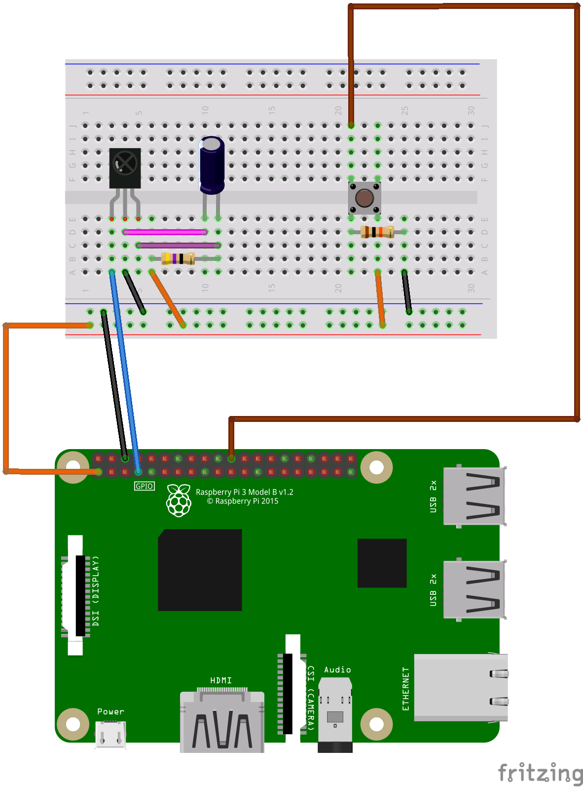

# 赤外線リモコンの学習
リモコンが送信している赤外線のパターンを学習し、学習したパターンを送信します。

## 赤外線リモコン受信部
最初は、テレビなどのリモコンのパターンを学習するための回路とコードの解説です。

### 必要なパーツ
| 秋月 通販コード | 型番 | 商品名 | 個数 | 備考 |
|--|--|--|--:|--|
| I-06487 | GP1UXC41QS | 赤外線リモコン受信モジュール | 1 |  |
| P-03120 | 35PK47MEFC5X11 | 電解コンデンサ 47μF | 1 | 赤外線受信モジュール用 |
| R-07964 | CFS100J47RB | カーボン抵抗 47Ω | 1 | 赤外線受信モジュール用<br>1Wが良いですが、<br>一時的にであれば1/2Wや1/4Wで代用 |
| P-03647 | TS-0606-F-N-BLK | タクトスイッチ | 1 |  |
| R-25103 | RD25S 10K | カーボン抵抗 10KΩ | 1 | タクトスイッチ用 |

抵抗やコンデンサなどは、バラ売りの部品でもOKです。

赤外線リモコン受信モジュールは、PL-IRM0101-3(I-00622)も利用できます。その場合はノイズ対策シールド付きなので、47μFの電解コンデンサと47Ωのカーボン抵抗が不要です。

赤外線リモコン受信モジュールのデータシート

https://akizukidenshi.com/download/ds/sharp/GP1UXC4xQS_j.pdf

### 受信回路配線


赤外線受信モジュールのパーツは、https://jumbleat.com/fritzing_custom/ で公開されているパーツを利用させていただきました。
### 回路の説明
左側の黒色の四角い部品が赤外線リモコン受信モジュールです。その右に配置されている円柱の部品が電解コンデンサです。

電源の3.3Vと赤外線リモコン受信モジュールの間にノイズを除去するためにCRフィルター(キャパシタ(コンデンサ)のCと抵抗のR)を配置します。

スイッチを押すと、リモコンの赤外線を受信するために待機状態になります。

赤外線受信モジュールが赤外線を受信するとVout(GP1UXC41QSの場合は、向かって左のピン)の電気が止まり、受信しないと電気が流れます。
### コード(部分)
```ruby
    RECORDING_TIMEOUT = 5

    # 赤外線受信モジュールと記録ボタン
    ir_receiver = PiPiper::Pin.new pin: 4
    recording_button = PiPiper::Pin.new pin: 25

    timings = []
    signal = ir_receiver.read
    pre_time = Time.now
    while Time.now - pre_time < RECORDING_TIMEOUT
      if ir_receiver.read != signal
        now_time = Time.now
        timings << now_time - pre_time
        pre_time = now_time
        signal ^= 1
      end
    end
    puts "end."
    # 先頭のタイミングは削除
    timings.shift
```

### コードの説明

赤外線リモコンは操作したい機材に向けて、赤外線LEDを特定のタイミングで高速に点灯と消灯を繰り返して機器の電源のONなどの命令を伝えています。タイミングは、テレビの電源をONにする命令とエアコンの電源をONにする命令では異なります。その点灯時間、消灯時間のパターンを読み取って配列に格納します。

赤外線リモコン受信モジュールが赤外線を受信するとir_receiver.readの値が0になり、受信しないと1になります。

今回、タイムロスを少しでもなくしたいので、ir_receiver.readの結果を直接判定していますが、
```
ir_receiver.read
ir_receiver.on?
```
として、GPIOの状態がONなのかOFFなのか判定する記述もできます。

その1と0の変化を捉えて、前回の状態と今回の状態が変わった時間の差(now_time - pre_time)を配列に追加します。

時間の差の単位はマイクロ秒(1μs = 1/1000000s)です。実際には点灯している時は、ここで捉える時間の差よりもずっと短い周期で点滅するのですが、ここでは大まかに点灯と消灯のタイミングを取得します。

リモコンは命令の送信が完了すると消灯になりますが、この回路とソフトウェアでは点灯と点灯の間の消灯と、命令を送り終わった後の消灯の違いは分かりませんので、5秒間受信できないと受信完了と判断して学習を終了します。

配列に格納した最初のタイミングは、回路のスイッチを押してからリモコンを押すまでの時間で不要なので削除します。
<br>
<br>
<br>
<br>
## 赤外線リモコン送信部
次に、学習した赤外線のパターンを送信する回路とコードの解説です。

### 必要なパーツ
| 秋月 通販コード | 型番 | 商品名 | 個数 | 備考 |
|--|--|--|--:|--|
| I-03261 | OSI5FU5111C-40 | 5mm赤外線LED 940nm | 1 |  |
| R-25751 | CF25J75RB | カーボン抵抗 75Ω | 1 | 赤外線LED用 |
| I-13829 | 2SC2120-Y | トランジスタ | 1 |  |
| R-25102 | CF25J1KB | カーボン抵抗 1KΩ | 2 | トランジスタ用 |
| P-03647 | TS-0606-F-N-BLK | タクトスイッチ | 1 |  |
| R-25103 | RD25S 10K | カーボン抵抗 10KΩ | 1 | タクトスイッチ用 |

抵抗やトランジスタなどは、バラ売りの部品でもOKです。

赤外線LEDのデータシート

https://akizukidenshi.com/download/OSI5FU5111C-40.pdf

トランジスタのデータシート

https://akizukidenshi.com/download/ds/Toshiba/2sc2120_toshiba.pdf

### 送信回路配線


### 回路の説明
ブレッドボード中央にあるのがトランジスタ、その上に配置されているのが赤外線LEDです。

今回使用する赤外線LEDは電圧が1.35V、電流は50mAから100mA、点滅の場合は最大1000mAまで流せます。Raspberry PiのGPIOだと1つのピンに流すことができる電流は最大26mAなので不足します。そのため、この回路では5Vの端子から電源をとります。ただ、そうするとON/OFFの制御ができないので、トランジスタでスイッチング回路を構成して、トランジスタへのON/OFF操作で5Vの電源のON/OFFを操作し、赤外線LEDを点滅させます。今回作成するリモコンでは、周波数38KHzでパルス発信しないといけないので、ハードウェアPWMが利用できるGPIOのピン(今回はGPIO18)を使用します。

周波数38KHzとは、1秒間に38000回の波が作られます。1秒 / 38000回 ≒ 0.00000263秒 = 26.3マイクロ秒ごとに波形が上下(**点滅**)します。ただ、26.3マイクロ秒ごとに**点灯**させないといけないので、半分の13.15マイクロ秒ごとに点滅させます。時間が半分なので倍の周波数76KHzになります。省エネを考えるとON/OFFの比率は1:2ぐらいでも良いらしいですが、今回は1:1の比率でON/OFFします。

トランジスタの仕組みですが、トランジスタには３本の足があり、今回使用するトランジスタの場合は、平らな面を手前にして左の端子からエミッタ(E)、コレクタ(C)、ベース(B)になります。電源の入り口(コレクタ)から、出口(エミッタ)に電流が流れます。流れを制御する端子(ベース)に少しの電流を流したり止めたりすることで、エミッタに電流を流したり止めたりできます。

トランジスタのノイズ対策として、GPIOとトランジスタの間の電流制限用抵抗と別に、GNDに向けて抵抗を配置しています。

以降、しばらく計算に使いますのでオームの法則をメモしておきます。
```
V = IR　から、V,I,Rをそれぞれ求める場合の計算式

電圧(V) = 電流(I) * 抵抗(R)    # 6 = 3 * 2
電流(I) = 電圧(V) / 抵抗(R)    # 3 = 6 / 2
抵抗(R) = 電圧(V) / 電流(I)    # 2 = 6 / 3
```

消費電力の計算式
```
電力(W) = 電圧(V) * 電流(A)
```

トランジスタには電流を増幅する効果があり、今回のトランジスタの場合は、倍率が160〜320と記載されています。電流を500mA流すと仮定すると
```
最小倍率で、500mA / 160 = 3.125mA
最大倍率で、500mA / 320 = 1.5625mA
```
となるので、3.125mAベース端子に電流を流せば良さそうです。

実際には、データシートのグラフから、ベース端子に3.3Vで3mA与えると360mAぐらいが取り出せることが読み取れます。

電圧が3.3Vで、2mA,3mA,4mAの電流を流したい場合に必要な抵抗はそれぞれ
```
R = V / I = 3.3 / 0.002 = 1650Ω
R = V / I = 3.3 / 0.003 = 1100Ω
R = V / I = 3.3 / 0.004 = 825Ω
```
となります。

1KΩ(1000Ω)の抵抗を使用した場合は
```
I = V / R = 3.3 / 1000 = 0.0033 = 3.3mA
```
となります。今回は1KΩの抵抗を使って、トランジスタのベース端子に流す電圧は3.3V、電流は3.3mA、取り出す電流は一旦360mAぐらいとします。
<br>
<br>
赤外線LEDの電圧が1.35V、電源の電圧が5V、赤外線LEDに流したい電流を360mA(0.36A)とすると
```
R = V / I = (5-1.35) / 0.36 = 10.138Ω
W = V * A = (5-1.35) * 0.36 = 1.314W
```
になります。消費電力が1Wを超えているので、もう少し抵抗値を大きくしてみます。

47Ωの抵抗を使用する場合は
```
I = V / R = (5-1.35) / 47 = 0.0776A
W = V * A = (5-1.35) * 0.0776 = 0.283W
```
となり、1/4Wを少しオーバーするので1/2Wの抵抗が必要になります。

75Ωの抵抗を使用する場合は
```
I = V / R = (5-1.35) / 75 = 0.0486A
W = V * A = (5-1.35) * 0.0486 = 0.177W
```
となり、1/4W抵抗の範囲内に収まりますので、今回は75Ωの抵抗を使用することにします。1/2W 47Ωの抵抗があればそれでも良いですし、1W 10Ωの抵抗を2つ直列で配置して抵抗値を20Ωとして利用できます。また、1W 10Ωの抵抗を1つとLEDを2つ直列で配置する組み合わせでも利用できます。

### コード(部分)
```ruby
    ir_transmitter = PiPiper::Pwm.new pin: 18, clock: 75.kilohertz, value: 0.5, start: false
    send_button = PiPiper::Pin.new pin: 24

    print "IR transmit start... "
    signal = 1
    timings.each do |timing|
      signal == 1 ? ir_transmitter.on : ir_transmitter.off
      sleep timing
      signal ^= 1
    end
    puts "end."
    ir_transmitter.off
```

### コードの説明
今回、作成する赤外線リモコンは38KHz周期で点滅させたいのですが、38KHzで設定すると38KHz周期でON,OFF,ON,OFF...となるようです。38KHzの周期でON,ON,ON,ON...となってほしいので、制御に使用する周期は倍の76KHzとします。ただし、指定する周波数は19.2MHzを2のn乗で割れる数値を指定しないといけないので近似値として
```
1900000 / 256 = 75000.0 = 75KHz
```
を指定します。

ボタンが押されたら、学習したタイミング、例えば900マイクロ秒の間、赤外線LEDをONにする場合は、コードではir_transmitterをonして900マイクロ秒待機(sleep)するだけですが、onの間はPWMにより、75KHzで高速にON,OFFされています。
<br>
<br>
<br>
<br>
## 赤外線リモコン送受部、受信部全体

### 赤外線送受信回路配線図


赤外線受信モジュールのパーツは、https://jumbleat.com/fritzing_custom/ で公開されているパーツを利用させていただきました。

### コード(全体)
```ruby
#
# 赤外線リモコンの学習
#
require 'pi_piper'
include PiPiper

RECORDING_TIMEOUT = 5

# 赤外線受信モジュールと記録ボタン
ir_receiver = PiPiper::Pin.new pin: 4
recording_button = PiPiper::Pin.new pin: 25

# 赤外線LEDと送信ボタン, 38KHz間隔でON/OFFを1:1で作成したいので更に倍にしています(75 / 2 = 37.5 ≒ 38)
ir_transmitter = PiPiper::Pwm.new pin: 18, clock: 75.kilohertz, value: 0.5, start: false
send_button = PiPiper::Pin.new pin: 24

# サンプルデータ
timings = [12908,2924,1049,934,1052,939,1047,949,1038,941,1046,936,1051,936,1050]
puts "#{timings.join(' ')}"
# サンプルデータをマイクロ秒に換算
timings = timings.map { |timing| timing / 1000000.0 }

puts "ready..."
loop do
  if recording_button.read == 1
    # チャタリング防止
    sleep 0.2

    print "IR receive start ... "
    timings = []
    signal = ir_receiver.read
    pre_time = Time.now
    while Time.now - pre_time < RECORDING_TIMEOUT
      if ir_receiver.read != signal
        now_time = Time.now
        timings << now_time - pre_time
        pre_time = now_time
        signal ^= 1
      end
    end
    puts "end."
    # 先頭のタイミングは削除
    timings.shift
    puts "#{timings.map { |timing| (timing*1000000).floor}.join(' ')}"
  end

  if send_button.read == 1
    # チャタリング防止
    sleep 0.2

    print "IR transmit start... "
    signal = 1
    timings.each do |timing|
      signal == 1 ? ir_transmitter.on : ir_transmitter.off
      sleep timing
      signal ^= 1
    end
    puts "end."
    ir_transmitter.off
  end

  # 適当にウェイトを入れて省エネ
  sleep 0.2
end
```

### コードの解説
プログラムの大きな動作として、ボタンが押されることを期待して、ずっとループします。

学習用ボタン、送信用ボタンが押されたら、それぞれ赤外線のパターンの学習と赤外線の発信をします。

ボタンを押した後、0.2秒の待ちを入れて誤動作を防止しています。

サンプルデータは、とあるカメラのシャッターリモコンのパターンです。

学習してもタイミングが悪く、うまく送信できない場合がありますので、何度か学習のし直しが必要な場合があります。

また、エアコンなど複雑なパターンの場合は、上手く再現できないかもしれません。
