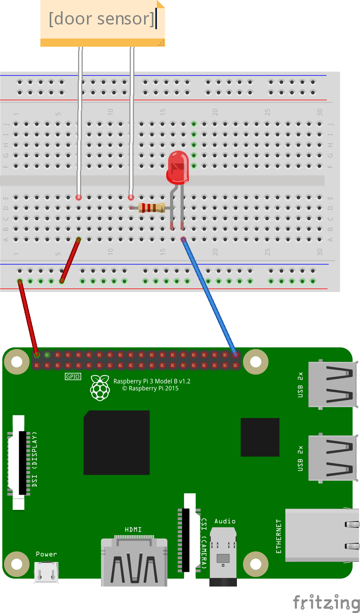

# 帰宅時に挨拶する
## 内容
ドアセンサーが反応したら、音声を流す

## 必要パーツ
| メーカー | 通販コード | 型番 | 商品 |
| ------- | -------- | --- | --- |
| SYNTEX TECH CORP. | P-13371 |SPS-320 |ドアセンサースイッチ(リードスイッチ) |
|  |  |  | スピーカー(ステレオミニプラグ接続、USBで電源供給) |
|  |  |  | LED |
|  |  |  | 10kΩ 抵抗 |

## ドアセンサー
スイッチが近づくとON, 離れるとOFF (プルダウン抵抗使用時)  

## 配線

  
図通りに配線出来ていれば、センサーを近づけるとLEDが点灯、遠ざけると消灯します。
　　
### コード
センサーを近づけたり、遠ざけたりした際の挙動をコンソールでも確認してみましょう。  

```ruby
require 'pi_piper'

# RaspberryPiのプルダウン抵抗を使用する
sensor_pin = PiPiper::Pin.new(pin: 21, direction: :in, pull: :down)

loop do
  # 21番pinの値を取得する
  sensor_pin.read
  # 21番pinがonかどうかを出力する
  puts sensor_pin.on?
  
  sleep 0.5
end
```

### コードの解説
センサーが近ければON `sensor_pin.on? => true`  
遠ければOFF `sensor_pin.on? => false` を出力するコードです。

```ruby
sensor_pin = PiPiper::Pin.new(pin: 21, direction: :in, pull: :down)
```
上記の`pull: :down`でRaspberryPiのプルダウン抵抗を利用する設定を行っています。  
ドアセンサースイッチは近づけるとONになるのですが、離している間の値は不定となります。  
(試しに上記コードの`pull: :down`を削除し実行してみると、センサーを離しているにも関わらずtrue,falseが勝手に切り替わっているのがコンソールに出力されているはずです。)    
これではドアの開閉を検知出来ないので、センサーが離れている時は必ず  
  `puts sensor_pin.on? => false`  
となるようにプルダウン抵抗を使用します。

## 音声の出力 
スピーカーから音が出る様に設定し、ファイルが再生出来ることを確認します。
### イヤホンジャックから音を出す設定に変更
`$ sudo raspi-config`
1. 7 Advanced Options を押下
2. A4 Audio を押下
3. 1 Force 3.5mm ('headphone') jack を押下

**※この設定をするとHDMIから音が出なくなる。HDMIで再生したいときは、設定を 0 Auto に変更する**

### 再生するファイルをダウンロード
`$ wget ファイルパス`

カレントディレクトリにファイルがダウンロードされます。  

### ダウンロードした.wavファイルを再生
`$ sudo aplay sample.wav`

**aplayは.wavのみ再生可能**
  
  
### コマンドから.wavファイルを再生する方法

`exec('sudo aplay sample.wav')`

### exec()の注意点
exec()は引数のコマンドを実行します。  
（上の例の場合は.wavファイルの再生を行う）  
コマンドの実行に成功すると、exec()を呼び出したプログラムに制御が返って来ずに処理が終了します。  
よって、再びプログラムを実行しようとすると指定したpinは前回の実行から使用中のままの為、使用できずに以下の様な例外が発生します。
```
Traceback (most recent call last):
	5: from greetings.rb:3:in `<main>'
	4: from greetings.rb:3:in `new'
	3: from /home/edu/ruby-hw_private/template/vendor/bundle/ruby/2.6.0/gems/pi_piper-2.0.0/lib/pi_piper/pin.rb:58:in `initialize'
	2: from /home/edu/ruby-hw_private/template/vendor/bundle/ruby/2.6.0/gems/pi_piper-2.0.0/lib/pi_piper/bcm2835.rb:34:in `pin_input'
	1: from /home/edu/ruby-hw_private/template/vendor/bundle/ruby/2.6.0/gems/pi_piper-2.0.0/lib/pi_piper/bcm2835.rb:65:in `export'
/home/edu/ruby-hw_private/template/vendor/bundle/ruby/2.6.0/gems/pi_piper-2.0.0/lib/pi_piper/bcm2835.rb:65:in `write': Device or resource busy @ fptr_finalize_flush - /sys/class/gpio/export (Errno::EBUSY)
```

この例外を回避するために、exec()実行前に必ずpinを終了しておきましょう。  
以下がpinの利用を終了させるコードです。  
```rb
# .wavファイルを再生する前に21番pinの利用を終了しておく
unexp = open("/sys/class/gpio/unexport", "w")
unexp.write(21)
unexp.close
```
`/sys/class/gpio/unexport`ファイルを書き込みモードで開き、`.write()`で終了させるピン番号を指定します。  
（今回は21番ピンを使用しているので、`21`を指定）  
最後に`.close()`でファイルを閉じておきます。

## Let's Try
1. 配線の画像とコードの通りに実装し、ドアセンサーを近づけたり離したりしてみましょう
2. センサーがONの時、.wavファイルを再生するプログラムを作成しましょう
3. 再生するファイルを.mp3に変更してみましょう

回答例は[こちら](../answers/practical_use/greetings)
