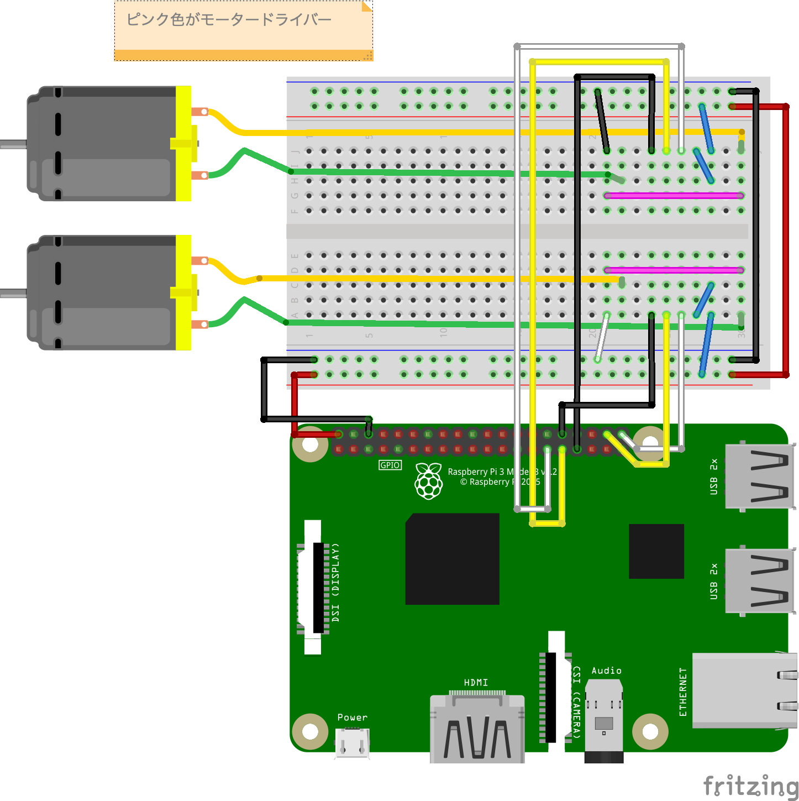

# WEBラジコン作成

今回は WEB画面ででモーターを操作できるようにします。

## 注意
本工程では、TCPSocket でポートをオープンしたり、ハードウェアに繋がったWebアプリを起動することになります。
認証の機構を設ける等、対策が必要です。
今回はテストプログラムなので、考慮していません。

## 必要なパーツ
| メーカー | 秋月 通販コード | 型番 | 商品名 | 個数 |
|--|--|--|--|--:|
| Anker | - | A1263011-9 | Anker PowerCore 10000 (モバイルバッテリー 10000mAh) | 1 |
| 協和ハーモネット | P-02220 | TCW 0.6mm 10m | スズメッキ線（０．６ｍｍ　１０ｍ） | 1 |
| 東芝 | I-02001 | TA7291P | モータードライバ | 2 |
| TAMIYA | - | ITEM 70168 | ダブルギヤボックス | 1 |
| TAMIYA | - | ITEM 70098 | ユニバーサルプレート | 1 |
| TAMIYA | - | ITEM 70229 | 32mm径スプロケット＆クローラーセット | 1 |
| logicool | - | C270N HD WEBCAM | ロジクールWebカメラ| 1 |


## 配線


## 動作確認用のコード
### Rails アプリ作成

#### `bundle init`

```bash
cd ~/
mkdir RadioControl; cd $_
bundle init
```

#### Gemfile 編集

```ruby
# frozen_string_literal: true

source "https://rubygems.org"

git_source(:github) {|repo_name| "https://github.com/#{repo_name}" }

gem "rails", "6.1.3"  # ここのコメントアウトを外し、バージョンを指定します。(「,」を忘れずに)
```

```bash
bundle install --path vendor/bundle
# かなり時間がかかります
```

#### `rails new`

```bash
bundle exec rails new .
# 途中で Gemfile を上書きするか確認されますが、 Enter キーを押下する
# かなり時間がかかります
```

#### webpackインストール
```bash
bundle exec rails webpacker:install
```

#### 設定
`Gemfile` の最後に次の行を追加します。

```ruby
gem 'pi_piper' # => PiPiper を使用するので追加
```

追加した gem をインストールします。

```bash
bundle install
```

### モーター制御サーバー作成

#### `mortorcontrol_server` タスク

このタスクは、TCP 2000番ポートで通信を待ち受けて、
クライアントから `Foward`,`Left`,`Right`,`Back`,`Brake`
のトークンが送られた場合に、トークンに応じてモーターを制御します。

まず、コンソールでタスクのファイルを作成します。

```bash
bundle exec rails generate task mortorcontrol_server
```

`RadioControl/lib/tasks/mortorcontrol_server.rake` が作成されているので、以下の通り修正します。

```ruby
require 'socket'
require './lib/components/ta7291p'

namespace :mortorcontrol_server do
  task wake_up: :environment do
    server_method
  end

  # モーター左
  # GPIO 20 -> 正転?
  # GPIO 21 -> 逆転?
  # GPIO 12 -> PWM
  @motor_left = Ta7291p.new(pwm_pin_id: 12, forward_pin_id: 20, back_pin_id: 21, power_value: 0.7)
  
  # モーター右
  # GPIO 5 -> 正転?
  # GPIO 6 -> 逆転?
  # GPIO 13 -> PWM
  @motor_right = Ta7291p.new(pwm_pin_id: 13, forward_pin_id: 5, back_pin_id: 6, power_value: 0.7)
  
  # サーバ接続 OPEN
  Server = TCPServer.new(2000)

  def server_method
    loop do
      # ソケット OPEN （クライアントからの接続待ち）
      socket = Server.accept

      while token = socket.gets
        token.chomp!

        puts "RECV: #{token}"

        case token
        when 'Forward'
          forward()
          puts_result(token, socket)
        when 'Left'
          left()
          puts_result(token, socket)
        when 'Right'
          right()
          puts_result(token, socket)
        when 'Back'
          back()
          puts_result(token, socket)
        when 'Breake'
          breake()
          puts_result(token, socket)
        else
          puts "Unknown token type. Recived token: #{token}"
        end
      end

    ensure
      # ソケット CLOSE
      socket.close
    end
  end

  private
  
  def puts_result(recived_request, socket)
    puts recived_request
    socket.puts "OK"
  end

  def forward()
    @motor_left.forward()
    @motor_right.forward()
  end

  def left()
    @motor_left.back()
    @motor_right.forward()
  end

  def right()
    @motor_left.forward()
    @motor_right.back()
  end

  def back()
    @motor_left.back()
    @motor_right.back()
  end

  def breake()
    @motor_left.breake()
    @motor_right.breake()
  end

end
```

`RadioControl/lib/components/ta7291p.rb` ファイルを作成し、以下の通り修正します。
```ruby
require 'pi_piper'

class Ta7291p
  attr_reader :forward_pin, :back_pin

  def initialize(pwm_pin_id:, forward_pin_id:, back_pin_id:, power_value: 0.5)
    @pwm_pin = pwm = PiPiper::Pwm.new pin: pwm_pin_id
    @forward_pin = PiPiper::Pin.new pin: forward_pin_id, direction: :out
    @back_pin = PiPiper::Pin.new pin: back_pin_id, direction: :out
    @power = power_value
    @pwm_pin.value = power_value
  end

  def power=(value)
    @power = value
    @pwm_pin.value = value
  end

  def power
    @power
  end

  def forward()
    @back_pin.off
    @forward_pin.on
  end

  def back()
    @forward_pin.off
    @back_pin.on
  end

  def breake()
    @forward_pin.off
    @back_pin.off
  end
end
```

### 動作確認
ここまでできたら、動作確認をします。ターミナルを2つ立ち上げて、1つでは、「センサーサーバー」をもう一つでは、「`rails console`」 を起動します。
`rails console` でTCPサーバーにアクセスして、応答が返ってくるか確認します。

1つめ

```bash
cd ~/RadioControl
rbenv sudo bundle exec rails mortorcontrol_server:wake_up
```

2つめ

```bash
cd ~/RadioControl
bundle exec rails console

socket = TCPSocket.open('localhost', 2000)
socket.puts 'Forward'
socket.flush
socket.gets

socket.puts 'Left'
socket.flush
socket.gets

socket.puts 'Right'
socket.flush
socket.gets

socket.puts 'Back'
socket.flush
socket.gets

socket.puts 'Breake'
socket.flush
socket.gets

socket.close
```

モーターが命令通りに動いていることを確認できたら成功です。
処理を終了する場合はそれぞれ`Ctrl + C`で終了します。


## Let's try

1. モーターを操作するWebApiを作成してみましょう。

回答例はこちら[RailsWebラジコンAPI回答](../answers/web_radio_controller/RailsWebラジコンAPI回答.md)

2. モーターを操作する画面を作成し、ラズベリーパイを操作してみましょう。

回答例はこちら[RailsWebラジコン画面回答](../answers/web_radio_controller/RailsWebラジコン画面回答.md)

3. モーターを操作する画面を追加し、カメラ映像を見ながらラズベリーパイを操作してみましょう

回答例はこちら[カメラストリーム配信](../answers/web_radio_controller/カメラストリーム配信.md)

